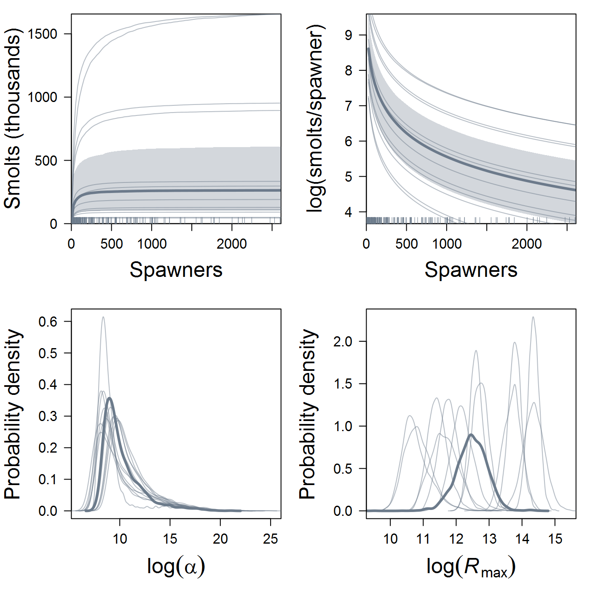
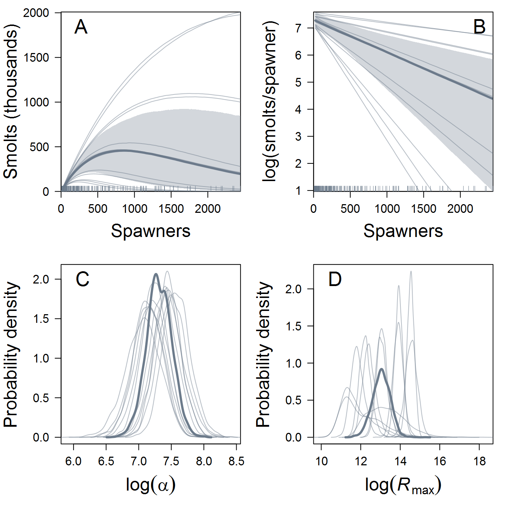
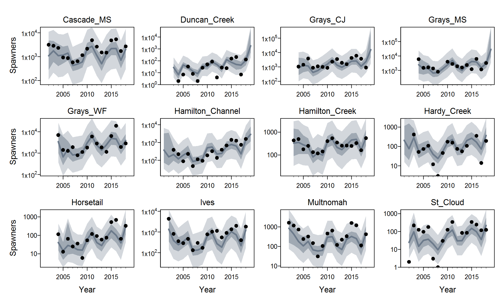
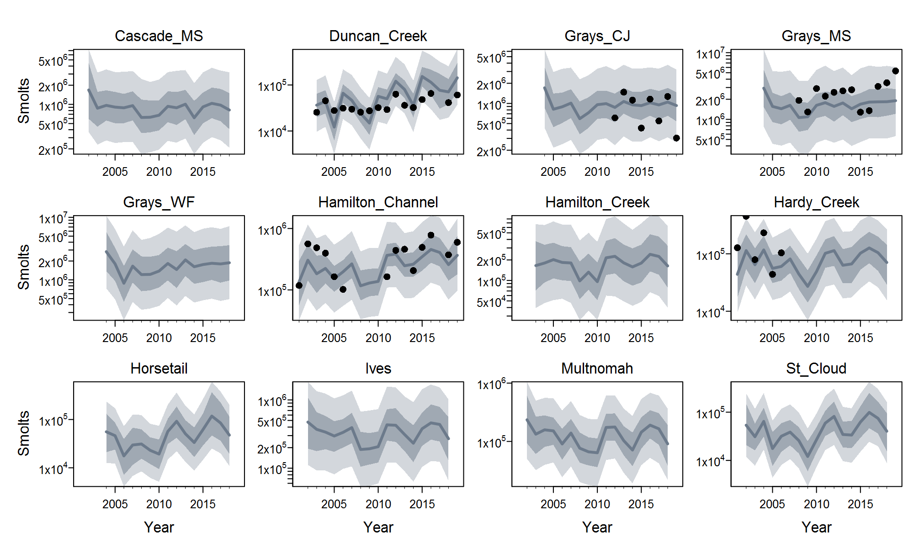
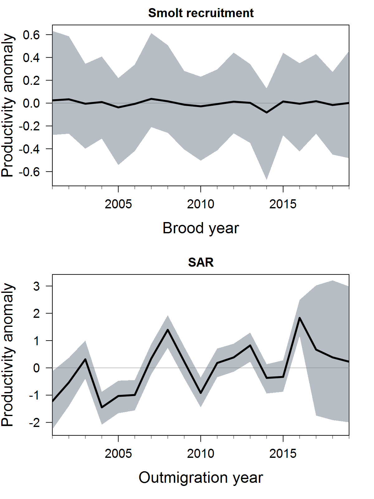
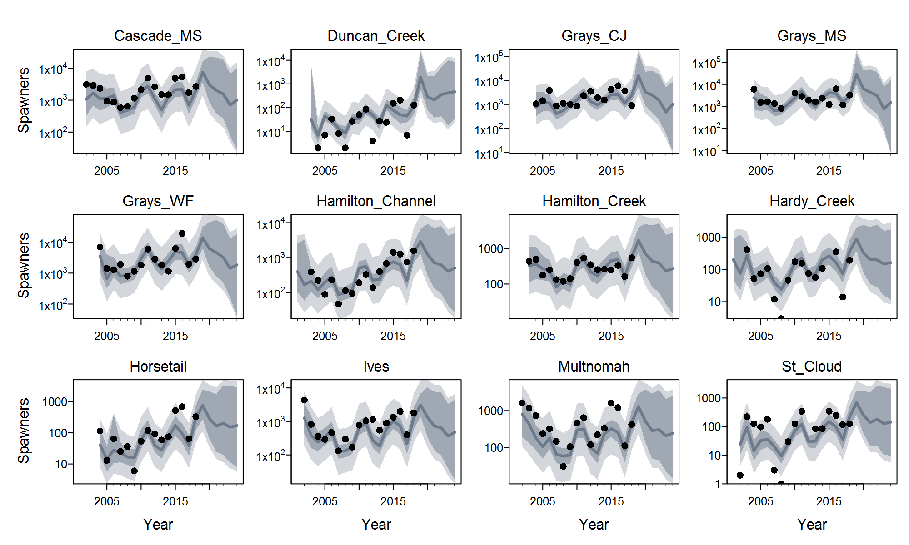

# Overview

Background on IPMs, outline of **salmonIPM**...

[eqns]


# Setup and data

Load the packages we'll need...


```r
options(device = ifelse(.Platform$OS.type == "windows", "windows", "quartz"))
options(mc.cores = parallel::detectCores(logical = FALSE) - 1)

library(salmonIPM)
library(rstan)
library(shinystan)
library(matrixStats)
library(tibble)
library(dplyr)
library(reshape2)
library(yarrr)
library(corrplot)
library(magicaxis)
library(zoo)
library(here)

if(file.exists(here("analysis","results","LCRchumIPM.RData")))
  load(here("analysis","results","LCRchumIPM.RData"))
```

Read in and manipulate the data...


```r
# Mapping of location to population
location_pop <- read.csv(here("data","Location.Reach_Population.csv"), 
                         header = TRUE, stringsAsFactors = TRUE) %>% 
  rename(strata = Strata, location = Location.Reach, pop1 = Population1, pop2 = Population2)

# Mapping of disposition to hatchery vs. wild (i.e., broodstock vs. natural spawner)
disposition_HW <- read.csv(here("data","Disposition_HW.csv"), 
                           header = TRUE, stringsAsFactors = TRUE) %>% 
  rename(disposition = Disposition) %>% arrange(HW)

# Start dates of hatcheries associated with populations
hatcheries <- read.csv(here("data","Hatchery_Programs.csv"), header = TRUE, stringsAsFactors = TRUE)

# Spawner abundance data
# Assumptions:
# (1) NAs in hatchery dispositions (incl. Duncan Channel) are really zeros
# (2) NAs in Duncan Creek from 2004-present are really zeros
# (3) All other NAs are real missing observations
spawner_data <- read.csv(here("data","Data_ChumSpawnerAbundance_2019-12-12.csv"), 
                         header = TRUE, stringsAsFactors = TRUE) %>% 
  rename(year = Return.Yr., strata = Strata, location = Location.Reach, 
         disposition = Disposition, method = Method, S_obs = Abund.Mean, SD = Abund.SD) %>% 
  mutate(pop = location_pop$pop2[match(location, location_pop$location)],
         disposition_HW = disposition_HW$HW[match(disposition, disposition_HW$disposition)],
         S_obs = replace(S_obs, is.na(S_obs) & disposition_HW == "H", 0),
         S_obs = replace(S_obs, is.na(S_obs) & pop == "Duncan_Creek" & year >= 2004, 0)) %>% 
  select(year:location, pop, disposition, disposition_HW, method:SD) %>% 
  arrange(strata, location, year)

names_S_obs <- disposition_HW$disposition
names_B_take_obs <- disposition_HW$disposition[disposition_HW$HW == "H"]

spawner_data_agg <- aggregate(S_obs ~ year + strata + pop + disposition,
                              data = spawner_data, FUN = sum, na.action = na.pass) %>%
  dcast(year + strata + pop ~ disposition, value.var = "S_obs", 
        fun.aggregate = identity, fill = 0) %>% 
  add_column(S_obs = rowSums(select(., all_of(names_S_obs))),
             B_take_obs = rowSums(select(., all_of(names_B_take_obs)))) %>% 
  select(-all_of(names_S_obs)) %>% arrange(strata, pop, year)

# Spawner age-, sex-, and origin-frequency (aka BioData)
bio_data <- read.csv(here("data","Data_ChumSpawnerBioData_2019-12-12.csv"), 
                     header = TRUE, stringsAsFactors = TRUE) %>% 
  rename(year = Return.Yr., strata = Strata, location = Location.Reach, 
         disposition = Disposition, origin = Origin, sex = Sex, age = Age, count = Count) %>% 
  mutate(pop = location_pop$pop2[match(location, location_pop$location)],
         origin_HW = ifelse(origin == "Natural_spawner", "W", "H"),
         count = ifelse(is.na(count), 0, count)) %>% 
  select(year:location, pop, disposition, origin, origin_HW, sex:count) %>%
  arrange(strata, location, year, origin, age, sex)

# age of wild spawners only
bio_data_age <- bio_data %>% filter(origin_HW == "W") %>%  
  dcast(year + strata + pop ~ age, value.var = "count", fun.aggregate = sum)

bio_data_origin <- bio_data %>% 
  dcast(year + strata + pop ~ origin_HW, value.var = "count", fun.aggregate = sum)

# Juvenile abundance data
# Assumptions:
# (1) Smolts from Duncan Channel represent all naturally produced offspring of spawners
#     in Duncan Creek (hence Duncan_Channel -> Duncan_Creek in location_pop)
# (2) Duncan_North + Duncan_South = Duncan_Channel, so the former two are redundant 
#     (not really an assumption, although the equality isn't perfect in all years)
juv_data <- read.csv(here("data", "Data_ChumJuvenileAbundance_2020-06-09.csv"), 
                     header = TRUE, stringsAsFactors = TRUE) %>% 
  rename(brood_year = Brood.Year, year = Outmigration.Year, strata = Strata, 
         location = Location.Reach, origin = Origin, trap_type = TrapType, 
         analysis = Analysis, partial_spawners = Partial.Spawners, raw_catch = RawCatch,
         M_obs = Abund_Mean, SD = Abund_SD, L95 = Abund_L95, U95 = Abund_U95, CV = Abund_CV,
         comments = Comments) %>% 
  mutate(pop = location_pop$pop2[match(location, location_pop$location)]) %>% 
  select(brood_year:location, pop, origin:comments) %>% arrange(strata, location, year)

# drop hatchery or redundant pops and cases with leading or trailing NAs in M_obs
head_noNA <- function(x) { cumsum(!is.na(x)) > 0 }
juv_data_incl <- juv_data %>% filter(pop %in% spawner_data$pop) %>% 
  mutate(location = factor(location), pop = factor(pop, levels = levels(spawner_data$pop))) %>% 
  group_by(pop) %>% filter(head_noNA(M_obs) & rev(head_noNA(rev(M_obs)))) %>% as.data.frame()

# Fish data formatted for salmonIPM
# Drop age-2 and age-6 samples (each is < 0.1% of aged spawners)
# Use A = 1 for now (so Rmax in units of spawners)
fish_data <- full_join(spawner_data_agg, bio_data_age, by = c("year","strata","pop")) %>% 
  full_join(bio_data_origin, by = c("year","strata","pop")) %>% 
  full_join(juv_data_incl, by = c("year","strata","pop")) %>%
  mutate(B_take_obs = replace(B_take_obs, is.na(B_take_obs), 0)) %>% 
  rename_at(vars(contains("Age-")), list(~ paste0(sub("Age-","n_age",.), "_obs"))) %>% 
  select(-c(n_age2_obs, n_age6_obs)) %>% 
  rename(n_H_obs = H, n_W_obs = W) %>% mutate(A = 1, fit_p_HOS = NA, F_rate = 0) %>% 
  mutate_at(vars(contains("n_")), ~ replace(., is.na(.), 0)) %>% 
  select(strata, pop, year, A, S_obs, M_obs, n_age3_obs:n_W_obs, 
         fit_p_HOS, B_take_obs, F_rate) %>% arrange(strata, pop, year) 

# fill in fit_p_HOS
for(i in 1:nrow(fish_data)) {
  pop_i <- as.character(fish_data$pop[i])
  start_year <- ifelse(pop_i %in% hatcheries$pop,
                       min(hatcheries$start_brood_year[hatcheries$pop == pop_i]) + 1,
                       NA)
  fish_data$fit_p_HOS[i] <- ifelse((!is.na(start_year) & fish_data$year[i] >= start_year) |
                                     fish_data$n_H_obs[i] > 0, 1, 0)
}

# # drop cases with initial NAs in S_obs unless bio data is present
# fish_data <- fish_data %>% mutate(n_age = rowSums(select(., n_age2_obs:n_age6_obs))) %>% 
#   group_by(pop) %>%  filter(head_noNA(S_obs) | cumsum(n_age) > 0) %>% 
#   select(-n_age) %>% as.data.frame()

# subsets for models with specific stage structure
# spawner-spawner: drop cases with initial NAs in S_obs, even if bio data is present
fish_data_SS <- fish_data %>% group_by(pop) %>% filter(head_noNA(S_obs)) %>% as.data.frame()
# spawner-spawner: drop cases with initial NAs in M_obs, even if bio data is present
fish_data_SMS <- fish_data %>% group_by(pop) %>% 
  filter(head_noNA(S_obs) | head_noNA(M_obs)) %>% as.data.frame()

# pad data with future years to generate forecasts
# use 5-year (1-generation) time horizon
fish_data_SMS_fore <- fish_data_SMS %>% group_by(pop) %>% 
  slice(rep(n(), max(fish_data_SMS$year) + 5 - max(year))) %>% 
  mutate(year = (unique(year) + 1):(max(fish_data_SMS$year) + 5),
         S_obs = NA, M_obs = NA, fit_p_HOS = 0, B_take_obs = 0, F_rate = 0) %>% 
  mutate_at(vars(starts_with("n_")), ~ 0) %>% 
  full_join(fish_data_SMS) %>% arrange(pop, year) %>% 
  mutate(forecast = year > max(fish_data_SMS$year)) %>% 
  select(strata:year, forecast, A:F_rate) %>% as.data.frame()
```

Let's look at the first few rows of `fish_data` to see the format **salmonIPM** expects...


```r
head(fish_data_SMS)
```

<div data-pagedtable="false">
  <script data-pagedtable-source type="application/json">
{"columns":[{"label":[""],"name":["_rn_"],"type":[""],"align":["left"]},{"label":["strata"],"name":[1],"type":["fctr"],"align":["left"]},{"label":["pop"],"name":[2],"type":["fctr"],"align":["left"]},{"label":["year"],"name":[3],"type":["int"],"align":["right"]},{"label":["A"],"name":[4],"type":["dbl"],"align":["right"]},{"label":["S_obs"],"name":[5],"type":["dbl"],"align":["right"]},{"label":["M_obs"],"name":[6],"type":["dbl"],"align":["right"]},{"label":["n_age3_obs"],"name":[7],"type":["dbl"],"align":["right"]},{"label":["n_age4_obs"],"name":[8],"type":["dbl"],"align":["right"]},{"label":["n_age5_obs"],"name":[9],"type":["dbl"],"align":["right"]},{"label":["n_H_obs"],"name":[10],"type":["dbl"],"align":["right"]},{"label":["n_W_obs"],"name":[11],"type":["dbl"],"align":["right"]},{"label":["fit_p_HOS"],"name":[12],"type":["dbl"],"align":["right"]},{"label":["B_take_obs"],"name":[13],"type":["dbl"],"align":["right"]},{"label":["F_rate"],"name":[14],"type":["dbl"],"align":["right"]}],"data":[{"1":"Cascade","2":"Cascade_MS","3":"2002","4":"1","5":"3160","6":"NA","7":"101","8":"114","9":"7","10":"0","11":"222","12":"0","13":"15","14":"0","_rn_":"1"},{"1":"Cascade","2":"Cascade_MS","3":"2003","4":"1","5":"2866","6":"NA","7":"19","8":"448","9":"26","10":"0","11":"493","12":"0","13":"0","14":"0","_rn_":"2"},{"1":"Cascade","2":"Cascade_MS","3":"2004","4":"1","5":"2324","6":"NA","7":"75","8":"203","9":"50","10":"0","11":"328","12":"0","13":"0","14":"0","_rn_":"3"},{"1":"Cascade","2":"Cascade_MS","3":"2005","4":"1","5":"923","6":"NA","7":"4","8":"38","9":"0","10":"1","11":"42","12":"1","13":"0","14":"0","_rn_":"4"},{"1":"Cascade","2":"Cascade_MS","3":"2006","4":"1","5":"869","6":"NA","7":"1","8":"41","9":"0","10":"0","11":"42","12":"0","13":"0","14":"0","_rn_":"5"},{"1":"Cascade","2":"Cascade_MS","3":"2007","4":"1","5":"576","6":"NA","7":"32","8":"115","9":"43","10":"0","11":"190","12":"0","13":"0","14":"0","_rn_":"6"}],"options":{"columns":{"min":{},"max":[10]},"rows":{"min":[10],"max":[10]},"pages":{}}}
  </script>
</div>


# Retrospective models

Fit two-stage spawner-smolt-spawner models and explore output...

Density-independent


```r
SMS_exp <- salmonIPM(fish_data = fish_data_SMS, ages = list(M = 1),
                     stan_model = "IPM_SMS_pp", SR_fun = "exp",
                     pars = c("mu_alpha","sigma_alpha","alpha",
                              "beta_phi_M","rho_phi_M","sigma_phi_M","phi_M","sigma_M",
                              "mu_MS","beta_phi_MS","rho_phi_MS",
                              "sigma_phi_MS","phi_MS","sigma_MS","s_MS",
                              "mu_p","sigma_gamma","R_gamma","sigma_p","R_p","p",
                              "tau_M","tau_S","p_HOS","M","S","q","LL"),
                     chains = 3, iter = 1500, warmup = 500,
                     control = list(adapt_delta = 0.99, max_treedepth = 13))
```

```r
print(SMS_exp, prob = c(0.025,0.5,0.975),
      pars = c("alpha","phi_M","phi_MS","p","p_HOS","S","M","s_MS","q","LL"), 
      include = FALSE, use_cache = FALSE)
```

```
Inference for Stan model: IPM_SMS_pp.
3 chains, each with iter=1500; warmup=500; thin=1; 
post-warmup draws per chain=1000, total post-warmup draws=3000.

                    mean se_mean    sd      2.5%       50%     97.5% n_eff Rhat
mu_alpha            6.68    0.00  0.17      6.35      6.68      7.01  1170 1.00
sigma_alpha         0.26    0.00  0.10      0.10      0.24      0.50   902 1.00
rho_phi_M           0.10    0.01  0.40     -0.68      0.13      0.77  1082 1.00
sigma_phi_M         0.43    0.01  0.19      0.07      0.42      0.85   561 1.01
sigma_M             0.11    0.00  0.07      0.01      0.10      0.27   331 1.00
mu_MS               0.00    0.00  0.00      0.00      0.00      0.00  1470 1.00
rho_phi_MS          0.42    0.01  0.29     -0.27      0.47      0.82   918 1.00
sigma_phi_MS        1.02    0.01  0.25      0.64      0.99      1.61  1153 1.00
sigma_MS            0.19    0.01  0.09      0.01      0.19      0.37   243 1.01
mu_p[1]             0.19    0.00  0.01      0.16      0.18      0.22  1162 1.00
mu_p[2]             0.75    0.00  0.01      0.72      0.75      0.78  1186 1.00
mu_p[3]             0.06    0.00  0.01      0.05      0.06      0.07  1175 1.00
sigma_gamma[1]      0.23    0.01  0.15      0.02      0.21      0.57   658 1.00
sigma_gamma[2]      0.14    0.00  0.10      0.01      0.12      0.39   664 1.00
R_gamma[1,1]        1.00     NaN  0.00      1.00      1.00      1.00   NaN  NaN
R_gamma[1,2]        0.29    0.02  0.54     -0.90      0.41      0.98  1013 1.00
R_gamma[2,1]        0.29    0.02  0.54     -0.90      0.41      0.98  1013 1.00
R_gamma[2,2]        1.00    0.00  0.00      1.00      1.00      1.00   438 1.00
sigma_p[1]          0.86    0.00  0.11      0.65      0.85      1.08   701 1.01
sigma_p[2]          0.43    0.01  0.10      0.23      0.43      0.63   286 1.01
R_p[1,1]            1.00     NaN  0.00      1.00      1.00      1.00   NaN  NaN
R_p[1,2]            0.58    0.01  0.19      0.16      0.61      0.84   542 1.01
R_p[2,1]            0.58    0.01  0.19      0.16      0.61      0.84   542 1.01
R_p[2,2]            1.00    0.00  0.00      1.00      1.00      1.00   197 1.00
tau_M               0.68    0.01  0.13      0.46      0.67      0.95   483 1.01
tau_S               0.90    0.00  0.07      0.77      0.90      1.05   936 1.00
lp__           -22491.99    1.26 30.20 -22552.91 -22491.06 -22434.93   575 1.01

Samples were drawn using NUTS(diag_e) at Sun Jun 28 22:09:03 2020.
For each parameter, n_eff is a crude measure of effective sample size,
and Rhat is the potential scale reduction factor on split chains (at 
convergence, Rhat=1).
```

Beverton-Holt


```r
SMS_BH <- salmonIPM(fish_data = fish_data_SMS, ages = list(M = 1),
                    stan_model = "IPM_SMS_pp", SR_fun = "BH",
                    pars = c("mu_alpha","sigma_alpha","alpha",
                             "mu_Rmax","sigma_Rmax","Rmax","rho_alphaRmax",
                             "beta_phi_M","rho_phi_M","sigma_phi_M","phi_M","sigma_M",
                             "mu_MS","beta_phi_MS","rho_phi_MS",
                             "sigma_phi_MS","phi_MS","sigma_MS","s_MS",
                             "mu_p","sigma_gamma","R_gamma","sigma_p","R_p","p",
                             "tau_M","tau_S","p_HOS","M","S","q","LL"),
                    chains = 3, iter = 1500, warmup = 500,
                    control = list(adapt_delta = 0.99, max_treedepth = 13))
```

```r
print(SMS_BH, prob = c(0.025,0.5,0.975),
      pars = c("alpha","Rmax","phi_M","phi_MS","p","p_HOS","S","M","s_MS","q","LL"), 
      include = FALSE, use_cache = FALSE)
```

```
Inference for Stan model: IPM_SMS_pp.
3 chains, each with iter=1500; warmup=500; thin=1; 
post-warmup draws per chain=1000, total post-warmup draws=3000.

                    mean se_mean    sd      2.5%       50%     97.5% n_eff Rhat
mu_alpha           10.20    0.18  1.96      8.07      9.59     15.86   121 1.05
sigma_alpha         1.31    0.03  0.73      0.18      1.17      2.84   821 1.00
mu_Rmax            12.48    0.01  0.47     11.53     12.49     13.34  1195 1.01
sigma_Rmax          1.47    0.01  0.37      0.91      1.42      2.36  1342 1.00
rho_alphaRmax       0.40    0.04  0.46     -0.67      0.50      0.98   148 1.03
rho_phi_M           0.08    0.01  0.46     -0.77      0.11      0.80  2392 1.00
sigma_phi_M         0.13    0.00  0.10      0.01      0.10      0.37   832 1.01
sigma_M             0.10    0.00  0.06      0.00      0.10      0.23   235 1.01
mu_MS               0.00    0.00  0.00      0.00      0.00      0.00  1596 1.00
rho_phi_MS          0.33    0.01  0.31     -0.34      0.36      0.81   878 1.00
sigma_phi_MS        1.14    0.01  0.24      0.77      1.11      1.70  1219 1.00
sigma_MS            0.15    0.01  0.07      0.02      0.16      0.28   180 1.01
mu_p[1]             0.18    0.00  0.02      0.15      0.18      0.21  1662 1.00
mu_p[2]             0.76    0.00  0.02      0.72      0.76      0.79  1736 1.00
mu_p[3]             0.07    0.00  0.00      0.06      0.07      0.07  1032 1.01
sigma_gamma[1]      0.28    0.00  0.14      0.04      0.27      0.61   883 1.00
sigma_gamma[2]      0.12    0.00  0.09      0.00      0.10      0.33  1012 1.00
R_gamma[1,1]        1.00     NaN  0.00      1.00      1.00      1.00   NaN  NaN
R_gamma[1,2]        0.35    0.01  0.51     -0.84      0.49      0.98  1848 1.00
R_gamma[2,1]        0.35    0.01  0.51     -0.84      0.49      0.98  1848 1.00
R_gamma[2,2]        1.00    0.00  0.00      1.00      1.00      1.00   328 1.00
sigma_p[1]          0.63    0.00  0.12      0.41      0.62      0.86   575 1.01
sigma_p[2]          0.37    0.01  0.10      0.18      0.37      0.58   193 1.05
R_p[1,1]            1.00     NaN  0.00      1.00      1.00      1.00   NaN  NaN
R_p[1,2]           -0.07    0.03  0.41     -0.90     -0.04      0.61   162 1.04
R_p[2,1]           -0.07    0.03  0.41     -0.90     -0.04      0.61   162 1.04
R_p[2,2]            1.00    0.00  0.00      1.00      1.00      1.00  2182 1.00
tau_M               0.67    0.00  0.10      0.50      0.66      0.88  1357 1.00
tau_S               0.96    0.00  0.08      0.81      0.96      1.15   736 1.01
lp__           -22509.65    1.25 30.40 -22570.93 -22509.37 -22450.78   590 1.00

Samples were drawn using NUTS(diag_e) at Fri Jun 26 17:20:34 2020.
For each parameter, n_eff is a crude measure of effective sample size,
and Rhat is the potential scale reduction factor on split chains (at 
convergence, Rhat=1).
```

Ricker


```r
SMS_Ricker <- salmonIPM(fish_data = fish_data_SMS, ages = list(M = 1),
                        stan_model = "IPM_SMS_pp", SR_fun = "Ricker",
                        pars = c("mu_alpha","sigma_alpha","alpha",
                                 "mu_Rmax","sigma_Rmax","Rmax","rho_alphaRmax",
                                 "beta_phi_M","rho_phi_M","sigma_phi_M","phi_M","sigma_M",
                                 "mu_MS","beta_phi_MS","rho_phi_MS",
                                 "sigma_phi_MS","phi_MS","sigma_MS","s_MS",
                                 "mu_p","sigma_gamma","R_gamma","sigma_p","R_p","p",
                                 "tau_M","tau_S","p_HOS","M","S","q","LL"),
                        chains = 3, iter = 1500, warmup = 500,
                        control = list(adapt_delta = 0.99, max_treedepth = 13))
```

```r
print(SMS_Ricker, prob = c(0.025,0.5,0.975),
      pars = c("alpha","Rmax","phi_M","phi_MS","p","p_HOS","S","M","s_MS","q","LL"), 
      include = FALSE, use_cache = FALSE)
```

```
Inference for Stan model: IPM_SMS_pp.
3 chains, each with iter=1500; warmup=500; thin=1; 
post-warmup draws per chain=1000, total post-warmup draws=3000.

                    mean se_mean    sd      2.5%       50%     97.5% n_eff Rhat
mu_alpha            7.31    0.01  0.20      6.92      7.31      7.70   527 1.02
sigma_alpha         0.23    0.00  0.10      0.07      0.22      0.46   987 1.00
mu_Rmax            13.04    0.02  0.45     12.13     13.05     13.87   576 1.01
sigma_Rmax          1.25    0.01  0.35      0.71      1.19      2.06   859 1.00
rho_alphaRmax       0.68    0.01  0.28     -0.06      0.76      0.99   615 1.00
rho_phi_M           0.03    0.01  0.44     -0.77      0.05      0.78  1999 1.00
sigma_phi_M         0.16    0.00  0.13      0.01      0.14      0.47   775 1.01
sigma_M             0.08    0.00  0.05      0.00      0.07      0.19   377 1.01
mu_MS               0.00    0.00  0.00      0.00      0.00      0.00  1025 1.00
rho_phi_MS          0.33    0.01  0.30     -0.33      0.34      0.80   599 1.00
sigma_phi_MS        1.08    0.01  0.25      0.69      1.04      1.68   967 1.00
sigma_MS            0.11    0.00  0.06      0.01      0.11      0.24   256 1.02
mu_p[1]             0.18    0.00  0.01      0.15      0.18      0.21  1625 1.00
mu_p[2]             0.75    0.00  0.01      0.72      0.75      0.78  1651 1.00
mu_p[3]             0.06    0.00  0.01      0.05      0.06      0.07  1481 1.00
sigma_gamma[1]      0.23    0.01  0.13      0.02      0.22      0.53   681 1.00
sigma_gamma[2]      0.12    0.00  0.09      0.01      0.11      0.35   744 1.00
R_gamma[1,1]        1.00     NaN  0.00      1.00      1.00      1.00   NaN  NaN
R_gamma[1,2]        0.26    0.02  0.54     -0.88      0.36      0.97  1071 1.00
R_gamma[2,1]        0.26    0.02  0.54     -0.88      0.36      0.97  1071 1.00
R_gamma[2,2]        1.00    0.00  0.00      1.00      1.00      1.00  1549 1.00
sigma_p[1]          0.77    0.01  0.11      0.56      0.77      1.00   511 1.01
sigma_p[2]          0.43    0.01  0.10      0.23      0.43      0.61   298 1.01
R_p[1,1]            1.00     NaN  0.00      1.00      1.00      1.00   NaN  NaN
R_p[1,2]            0.37    0.01  0.24     -0.17      0.41      0.73   361 1.01
R_p[2,1]            0.37    0.01  0.24     -0.17      0.41      0.73   361 1.01
R_p[2,2]            1.00    0.00  0.00      1.00      1.00      1.00   422 1.00
tau_M               0.70    0.00  0.10      0.52      0.69      0.93  1056 1.00
tau_S               0.91    0.00  0.07      0.79      0.90      1.05   755 1.00
lp__           -22496.44    1.09 29.78 -22556.05 -22496.22 -22438.51   751 1.00

Samples were drawn using NUTS(diag_e) at Fri Jun 26 15:15:42 2020.
For each parameter, n_eff is a crude measure of effective sample size,
and Rhat is the potential scale reduction factor on split chains (at 
convergence, Rhat=1).
```

Model comparison based on LOO (unhelpful because Pareto ks are too high)


```r
LL_SMS <- lapply(list(exp = SMS_exp, BH = SMS_BH, Ricker = SMS_Ricker),
             loo::extract_log_lik, parameter_name = "LL", merge_chains = FALSE)

# Relative ESS of posterior draws of observationwise likelihood 
r_eff_SMS <- lapply(LL_SMS, function(x) relative_eff(exp(x)))

# PSIS-LOO
LOO_SMS <- lapply(1:length(LL_SMS), function(i) loo(LL_SMS[[i]], r_eff = r_eff_SMS[[i]]))
names(LOO_SMS) <- names(LL_SMS)

## Compare all three models
loo_compare(LOO_SMS)
```

```
       elpd_diff se_diff
Ricker   0.0       0.0  
exp     -7.5       7.0  
BH     -20.1       8.8  
```

```r
## Exponential vs. Ricker
loo_compare(LOO_SMS[c("exp","Ricker")])
```

```
       elpd_diff se_diff
Ricker  0.0       0.0   
exp    -7.5       7.0   
```

```r
## Exponential vs. Beverton-Holt
loo_compare(LOO_SMS[c("exp","BH")])
```

```
    elpd_diff se_diff
exp   0.0       0.0  
BH  -12.6      11.1  
```

```r
## Beverton-Holt vs. Ricker
loo_compare(LOO_SMS[c("BH","Ricker")])
```

```
       elpd_diff se_diff
Ricker   0.0       0.0  
BH     -20.1       8.8  
```

Plot estimated spawner-smolt production curves and parameters for the Beverton-Holt model.



**Figure 1: **Estimated Beverton-Holt spawner-recruit relationship (A, B) and intrinsic productivity (C) and capacity (D) parameters for the multi-population IPM. Thin lines correspond to each of 12 populations of Lower Columbia chum salmon; thick lines represent hyper-means across populations. In (A, B), each curve is a posterior median and the shaded region represents the 90% credible interval of the hyper-mean curve (uncertainty around the population-specific curves is omitted for clarity).

Now do the same for the Ricker model.



**Figure 2: **Estimated Ricker spawner-recruit relationship (A, B) and intrinsic productivity (C) and capacity (D) parameters for the multi-population IPM. Thin lines correspond to each of 12 populations of Lower Columbia River chum salmon; thick lines represent hyper-means across populations. In (A, B), each curve is a posterior median and the shaded region represents the 90% credible interval of the hyper-mean curve (uncertainty around the population-specific curves is omitted for clarity).

The Ricker model is more biologically plausible, so let's proceed with that model for now. Here are the fits to the spawner data:



**Figure 3: **Observed (points) and estimated spawner abundance for Lower Columbia River chum salmon populations. The posterior median (solid gray line) is from the multi-population IPM. Posterior 90% credible intervals indicate process (dark shading) and observation (light shading) uncertainty.

And here are the fits to the much sparser smolt data:



**Figure 4: **Observed (points) and estimated smolt abundance for Lower Columbia River chum salmon populations. The posterior median (solid gray line) is from the multi-population IPM. Posterior 90% credible intervals indicate process (dark shading) and observation (light shading) uncertainty.

We can examine how the model partitions shared interannual fluctuations between the two life-stage transitions...



**Figure 5: **Estimates of shared (ESU-level) process errors from the multi-population IPM fitted to Lower Columbia River chum salmon data. The top panel shows the shared anomalies around the Ricker spawner recruit function, and the bottom panel shows the average SAR.


# Forecasts

It is straightforward to use the IPM to generate forecasts of population dynamics...



**Figure 6: **Observed (points) and estimated spawner abundance for Lower Columbia River chum salmon populations, including 5-year forecasts. The posterior median (solid gray line) is from the multi-population IPM. Posterior 90% credible intervals indicate process (dark shading) and observation (light shading) uncertainty.


Of course we could also look at forecasts of smolts, or any other state variable. Here are the 2020 forecasts of wild spawners for each population...

<table class="table table-striped table-hover" style="width: auto !important; margin-left: auto; margin-right: auto;">
 <thead>
  <tr>
   <th style="text-align:left;"> Population </th>
   <th style="text-align:left;"> Estimate </th>
  </tr>
 </thead>
<tbody>
  <tr>
   <td style="text-align:left;"> Cascade_MS </td>
   <td style="text-align:left;"> 3020 (828, 23392) </td>
  </tr>
  <tr>
   <td style="text-align:left;"> Duncan_Creek </td>
   <td style="text-align:left;"> 282 (79, 2075) </td>
  </tr>
  <tr>
   <td style="text-align:left;"> Grays_CJ </td>
   <td style="text-align:left;"> 3272 (892, 22673) </td>
  </tr>
  <tr>
   <td style="text-align:left;"> Grays_MS </td>
   <td style="text-align:left;"> 6267 (1589, 43739) </td>
  </tr>
  <tr>
   <td style="text-align:left;"> Grays_WF </td>
   <td style="text-align:left;"> 6135 (1587, 44327) </td>
  </tr>
  <tr>
   <td style="text-align:left;"> Hamilton_Channel </td>
   <td style="text-align:left;"> 1237 (306, 9188) </td>
  </tr>
  <tr>
   <td style="text-align:left;"> Hamilton_Creek </td>
   <td style="text-align:left;"> 724 (181, 4959) </td>
  </tr>
  <tr>
   <td style="text-align:left;"> Hardy_Creek </td>
   <td style="text-align:left;"> 332 (81, 2409) </td>
  </tr>
  <tr>
   <td style="text-align:left;"> Horsetail </td>
   <td style="text-align:left;"> 286 (63, 2089) </td>
  </tr>
  <tr>
   <td style="text-align:left;"> Ives </td>
   <td style="text-align:left;"> 1337 (344, 10212) </td>
  </tr>
  <tr>
   <td style="text-align:left;"> Multnomah </td>
   <td style="text-align:left;"> 521 (136, 3697) </td>
  </tr>
  <tr>
   <td style="text-align:left;"> St_Cloud </td>
   <td style="text-align:left;"> 254 (59, 1782) </td>
  </tr>
  <tr>
   <td style="text-align:left;"> Total </td>
   <td style="text-align:left;"> 24264 (7273, 171231) </td>
  </tr>
</tbody>
</table>


